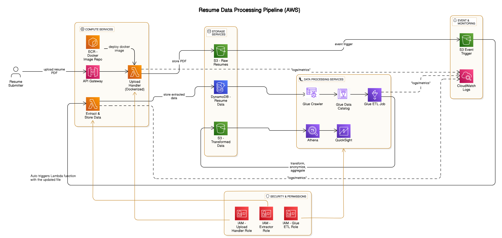

# 📄 Resume Processing Pipeline using AWS Serverless Services

This project is a **serverless resume parsing pipeline** on AWS that processes PDF resumes, extracts structured data, stores it, and enables visual insights using AWS QuickSight. The system is fully automated using **Lambda**, **S3**, **DynamoDB**, **Glue**, **Athena**, and **QuickSight**.

---

## 🏁 Getting Started

### Prerequisites
- AWS Account with permissions for Lambda, S3, DynamoDB, Glue, Athena, QuickSight
- Docker & AWS CLI installed and configured

### Quick Start
- bash
    ```bash
    # Clone repo
    git clone https://github.com/your-username/resume-pipeline.git
    cd resume-pipeline

    # Build Docker and deploy Lambda
    ./deployment/deploy_lambda.sh

    # Deploy CloudFormation stack
    aws cloudformation deploy \
    --template-file cloudformation_templates/deployment_template.yaml \
    --stack-name ResumePipeline

## 🚀 Features

- 📤 Upload PDF resumes via API Gateway
- 🪄 Extract text/data using Lambda functions (Dockerized for custom parsing)
- ☁️ Store raw PDFs in S3 and extracted data in DynamoDB
- 🔁 Automatic Glue crawler + ETL transformation
- 🔎 Query structured data with Athena
- 📊 Create interactive dashboards with QuickSight
- 🔔 Logs & monitoring via CloudWatch

---

## 📌 Architecture Overview



- **User** uploads resume via REST API Gateway
- **Lambda1** stores PDF in **S3 (raw)**
- **S3 trigger** invokes **Lambda2** to extract and insert into **DynamoDB**
- **AWS Glue** crawls and transforms data into **S3 (transformed)**
- **Athena** runs queries on transformed data
- **QuickSight** dashboard visualizes insights

---

## 🛠️ Tech Stack

| Service      | Purpose                                      |
|--------------|----------------------------------------------|
| API Gateway  | Resume Upload Endpoint                       |
| Lambda       | PDF Upload Handler & Data Extractor          |
| S3           | Store raw and transformed data               |
| DynamoDB     | Store extracted structured resume data       |
| AWS Glue     | Crawl + Transform data                       |
| Athena       | Query transformed JSON data                  |
| QuickSight   | Visual dashboards from Athena datasets       |
| CloudWatch   | Monitoring and Logs                          |

---

## 📂 Project Structure

- Here is the **Repository Structure** for folders and content.

    ``` bash
    resume-processing-pipeline/
    ├── architecture/                      # Architecture assets
    │   ├── architecture_diagram.png       # Final architecture image
    ├── screenshots/                       # Demo screenshots of different components
    │
    ├── lambda_upload_handler/            # Lambda function for resume upload
    │   ├── Dockerfile                     # Dockerfile for Lambda packaging
    │   ├── app.py                         # Lambda function entry point
    │   └── requirements.txt               # Python dependencies
    │
    ├── lambda_extractor/                 # Lambda for parsing resumes and extracting data
    │   ├── extractor.py
    │   └── requirements.txt
    │
    ├── glue_jobs/                         # AWS Glue ETL scripts
    │   └── resume_transform_job.py
    │
    ├── cloudformation_templates/         # Infrastructure as Code templates
    │   └── deployment_template.yaml
    │
    ├── project_report/                   # Detailed project report
    │   └── Resume_Processing_Project_Report.pdf
    │
    ├── config/                            # Configuration files
    │   └── glue_crawler_config.json
    ├── README.md                          # Project overview and setup instructions
    ├── LICENSE                            # Open-source license (MIT)
    └── .gitignore                         # Git ignored files


---

## 🧪 Sample Athena Query
- sql
    ```sql
    SELECT name, email, skills 
    FROM resume_data_transformed 
    WHERE ARRAY_CONTAINS(skills, 'AWS');

## 🐳 Resume Parser Lambda

Dockerized AWS Lambda handler for parsing complex PDF formats and NLP pre-processing.

## 🚀 Deployment

### Build & Push to ECR
- bash
    ```bash
    docker build -t resume-parser-lambda .

    aws ecr create-repository --repository-name resume-parser-lambda

    docker tag resume-parser-lambda:latest <account_id>.dkr.ecr.<region>.amazonaws.com/resume-parser-lambda

    docker push <account_id>.dkr.ecr.<region>.amazonaws.com/resume-parser-lambda

## Validation Steps

###  1. Use **Postman** or `curl`:
- bash
    ```bash
    curl -X POST https://<api_gateway_url>/upload \
    -F "file=@sample_resume.pdf"

### 2. Post-Upload Validation Checklist

| Step | Service         | ✅ Validation Criteria                                |
|------|------------------|-------------------------------------------------------|
| 1    | 📂 **S3**         | PDF is saved in the **raw bucket**                   |
| 2    | 🔄 **Lambda**     | CloudWatch **logs show event trigger**               |
| 3    | 🗃️ **DynamoDB**   | Parsed resume data is **stored as a new entry**       |
| 4    | 🧪 **Athena**     | Data is **queryable via SQL**                        |
| 5    | 📊 **QuickSight** | Dashboard **reflects the new data** update           |

    
## 📄 Project Report
See complete documentation in [`project_report/Resume_Processing_Project_Report.pdf`](project_report/Resume_Processing_Project_Report.pdf) containing:
- Problem statement
- Architecture design
- Component responsibilities
- Data flow explanation
- AWS service cost estimation (optional)
- Future enhancements

## 🛠️ Setup & Deployment
Choose one method:

### CloudFormation

aws cloudformation deploy --template-file cloudformation_templates/deployment_template.yaml


### Manual Deployment
1. Deploy Docker Lambda to ECR
2. Create S3 buckets for input/output
3. Setup DynamoDB table for metadata
4. Configure IAM roles and permissions
5. Set up AWS Glue crawler and ETL jobs
6. Create Athena database and tables
7. Connect Athena to QuickSight for visualization

## 🔮 Future Improvements
- Implement ML-based resume ranking (job description matching)
- Add notification system (SNS/email) for processing completion
- Integrate OCR for scanned PDF resumes
- Enhance error handling and retry mechanisms

## 📜 License
**MIT License** - Open source project. See [LICENSE](LICENSE) for details.
